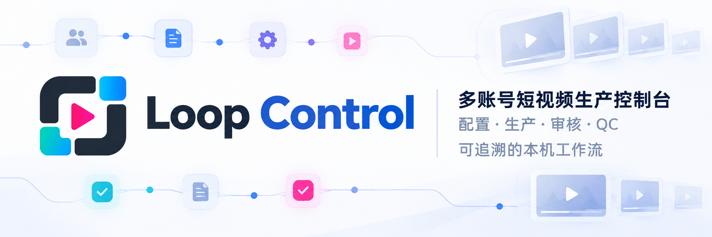

<div align="center">

# Loop Control

**面向单一 Owner 的多账号短视频生产控制台，把配置、素材、生产、审核、QC 和最终交付包放在一条可追溯流程里。**



</div>

## 项目概览

Loop Control 用于管理多个内容账号和系列的短视频生产。每个 Episode 在创建时冻结账号蓝图与系列规则，本机 Worker 按选定执行路径处理任务，Owner 在控制台提供素材、审核结果并处理阻塞项。最终视频、封面、元数据和校验清单固定为发布包后，Episode 进入“生产完成”。

平台记录的是可验证的生产过程，不代替第三方平台的发布后台，也不把“生产完成”表述为已经对外发布。

## 核心能力

- **版本化生产配置：** 按账号维护蓝图、系列规则、生产能力、Adapter 和外部连接；既有 Episode 保留创建时的配置快照。
- **受控素材与本地产物：** Owner 上传主脚本和人工素材，产物只在蓝图指定的媒体库边界内读取、冻结和预览。
- **可追溯生产与审核：** 从脚本输入、视觉准备、分镜和逐镜头制作推进到审核渲染与 QC，保留任务、审核包和状态迁移证据。
- **本机生产协作：** n8n 负责定时派发与提醒，本机 Worker 执行媒体任务，OpenChatCut 提供可编辑工程和渲染能力。
- **可校验交付：** QC 通过后生成视频、封面、发布元数据和发布包清单，并在完整性校验通过后结束本期生产。

## 典型流程

1. 创建账号，配置版本化蓝图、系列规则和所需生产能力。
2. 创建 Episode，上传并确认主脚本及本期人工素材。
3. 运行生产前检查；通过后由 n8n 派发任务，本机 Worker 执行对应步骤。
4. Owner 依次审核视觉、分镜和镜头输入，并按需在 OpenChatCut 中调整可编辑工程。
5. 生成审核视频，完成 QC，补齐封面和发布元数据。
6. 系统固定并校验发布包，将 Episode 标记为“生产完成”；外部发布由 Owner 在目标平台完成。

## 首次准备

项目固定使用 Node.js 24。安装仓库依赖：

```zsh
npm ci
```

创建 `.env.local`，这里只能放前端公开配置：

```dotenv
VITE_SUPABASE_URL=https://<项目引用>.supabase.co
VITE_SUPABASE_PUBLISHABLE_KEY=<Supabase publishable key>
```

复制 Worker 配置：

```zsh
cp n8n/worker.env.example n8n/worker.env.local
```

填写本机服务和渲染配置：

```dotenv
SUPABASE_URL=https://<项目引用>.supabase.co
SUPABASE_SERVICE_ROLE_KEY=<仅限本机的 service role key>
OPENCHATCUT_ROOT=/absolute/path/to/OpenChatCut
OPENCHATCUT_NODE=/opt/homebrew/opt/node@24/bin/node
MEDIA_LIBRARY_MOUNT_PATH=/Volumes/<外置媒体盘>
MEDIA_LIBRARY_MIN_FREE_BYTES=21474836480
# 调整后需重新运行 n8n/import-workflows.sh；默认值分别为 15 和 30 分钟。
LOOP_DISPATCH_INTERVAL_MINUTES=15
LOOP_NOTIFICATION_INTERVAL_MINUTES=30
```

OpenChatCut 使用独立源码目录，当前适配版本为 `0.2.14`：

```zsh
brew install node@24
git clone https://github.com/0xsline/OpenChatCut.git ../OpenChatCut
cd ../OpenChatCut
PATH="$(brew --prefix node@24)/bin:$PATH" npm ci
cd -
```

n8n 固定为 `2.34.5`，与 Loop Control、OpenChatCut 共用 Homebrew Node 24。运行依赖安装在仓库忽略的 `n8n/node24/node_modules`，业务数据仍保存在 `n8n/runtime`：

```zsh
PATH="$(brew --prefix node@24)/bin:$PATH" \
  "$(brew --prefix node@24)/bin/npm" ci --prefix n8n/node24 --omit=dev
n8n/import-workflows.sh
```

导入脚本会更新并发布四条工作流：任务派发、审核提醒、状态变更提醒和每日健康检查。

## 启动

日常只有一个入口：

```zsh
npm start
```

该命令会依次完成：

1. 使用 Homebrew Node 24 启动 Loop Control，并确认 OpenChatCut 使用同一 Node。
2. 检查前端公开 Supabase 配置、Worker 密钥隔离，并用该公开配置完成只读 API 探针。
3. 检查 OpenChatCut 安装及当前本机 n8n 实例中四条工作流的启用状态。
4. 启动 n8n 和 Vite 控制台；只有带有本项目服务记录且身份与健康响应都匹配的实例才会复用。
5. 等待两个服务可访问，打印实际地址并自动打开控制台。

Supabase 探针只验证 API 可达和公开配置；进入控制台后的数据读取由 Owner 会话与 RLS 验证。未经登录的 REST 401 不能用来判断 publishable key 无效。

正常结果：

```text
Loop Control 已启动
运行时：Loop Control、OpenChatCut、n8n 统一使用 Homebrew Node 24。
控制台：http://127.0.0.1:5173/
n8n：http://127.0.0.1:5678/
  任务派发工作流已启用
  审核提醒工作流已启用
  状态变更提醒工作流已启用
  每日健康检查工作流已启用
Supabase：API 可达，前端公开配置有效；数据权限在登录后由会话/RLS 验证
OpenChatCut：可用
媒体库：已挂载（<实际路径>）
```

媒体库未挂载时，控制台和 n8n 仍会启动，最后一行显示 `媒体库：不可用`。此时可以登录控制台查看远端数据和配置；系统状态会把媒体库标为离线，涉及本地产物的 Worker、预览和发布包操作会被阻止，挂载恢复后即可继续。

浏览器打开后，使用 Owner 邮箱通过密码或登录链接进入控制台。OpenChatCut 不会常驻启动；只有在生产单中点击“在 OpenChatCut 中打开”或 Worker 执行渲染时才启动临时本机实例。

停止本项目服务：

```zsh
npm stop
```

停止时会先核验本项目服务记录，再补充发现命令路径和工作目录都属于本仓库的 n8n、Vite 遗留进程；即使旧服务记录被后续启动覆盖，也会一并关闭。不会仅凭端口号停止其他项目的进程。

## 本机运行结构

- **浏览器控制台：** 展示账号、Episode、审核、任务和系统状态；远端数据访问使用 Owner 会话并受 Supabase RLS 约束。
- **本机控制面：** 由 Vite 的开发和预览运行时装载，在验证 Owner 身份后连接浏览器与本机文件、Worker、OpenChatCut 和运行证据。它不是独立部署的公开服务。
- **n8n：** 运行任务派发、审核提醒、状态变更提醒和每日健康检查四条本机工作流。
- **Worker：** 根据冻结的任务输入和 Adapter 配置执行媒体处理、渲染、索引与发布包准备。
- **OpenChatCut：** 仅在 Owner 打开编辑工程或 Worker 执行渲染时按需启动。

## 验证

```zsh
npm run check
npm test
npm run build
```

OpenChatCut 的真实渲染集成测试需要本机已安装并配置对应源码目录：

```zsh
npm run test:openchatcut-integration
```

## 技术栈

- React 19、TypeScript 5 和 Vite 7
- Supabase Auth、PostgreSQL 与 RLS
- Node.js 24 本机 Worker
- n8n 2.34.5
- OpenChatCut 0.2.14 与 FFmpeg
- Vitest

## 当前边界

- 控制台、本机控制面、n8n 和 OpenChatCut 都只监听本机地址，不是面向公网部署的一体化 SaaS。
- 本地产物必须位于账号蓝图配置的外置媒体库内，并写入产物索引后才能预览。
- `SUPABASE_SERVICE_ROLE_KEY` 只保存在 `n8n/worker.env.local`，不能进入前端环境或 Git。
- 当前主流程要求 Owner 提供并确认主脚本；平台不自动生成主脚本。
- “生产完成”只表示发布包已生成并通过校验，不表示内容已经发布到 TikTok 等第三方平台。
